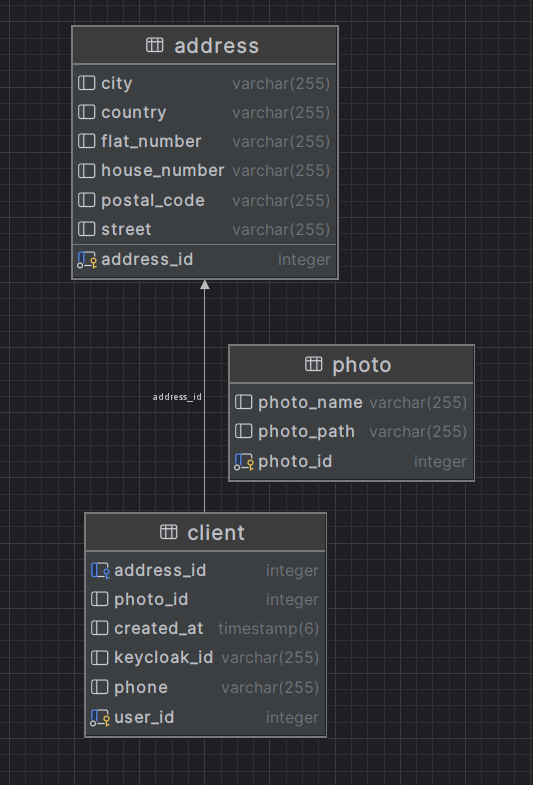
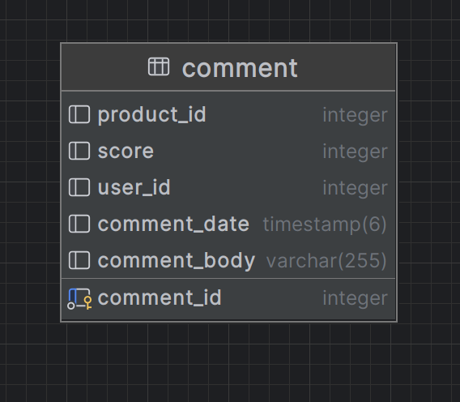
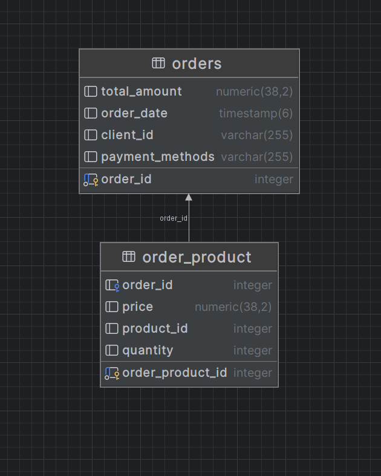
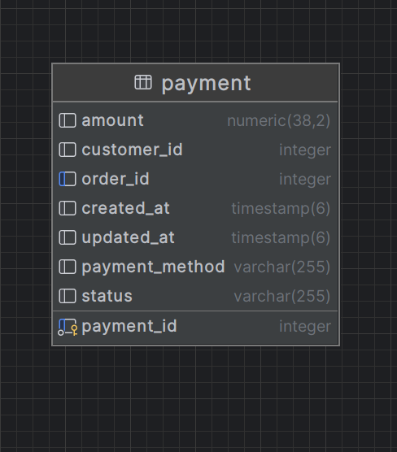
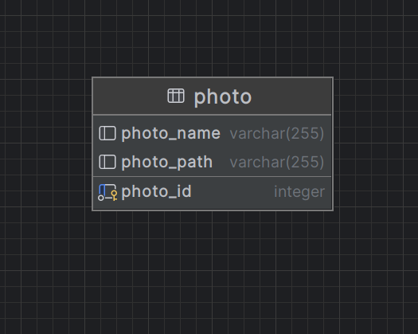
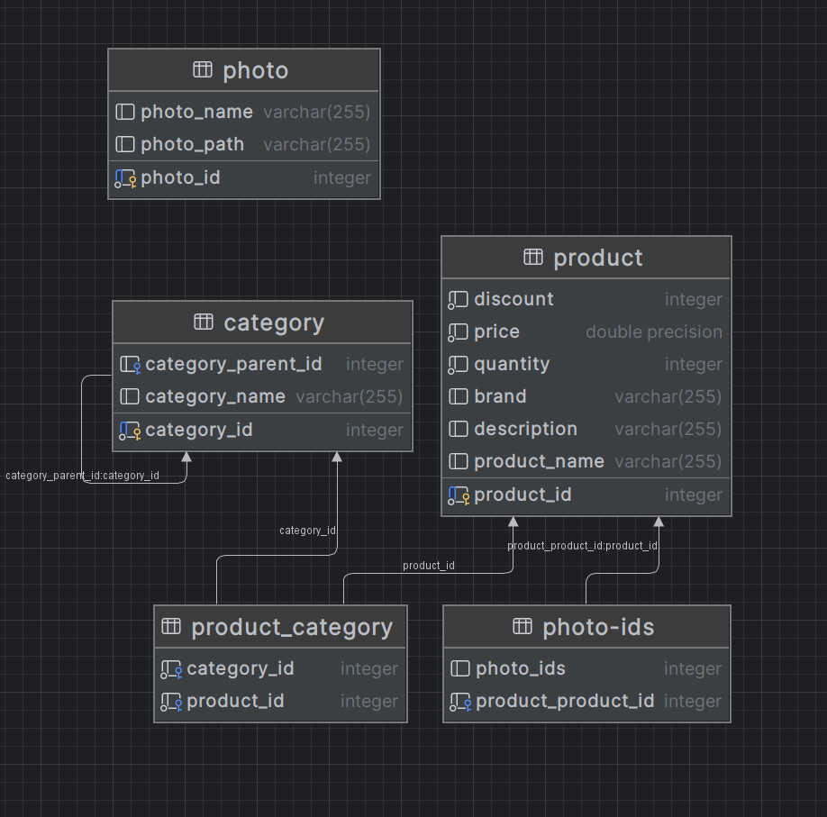

Spring Boot Microservices Application

📌 Opis projektu

Ten projekt to aplikacja oparta na architekturze mikroserwisowej, zbudowana przy użyciu Spring Boot. System składa się z kilku mikroserwisów komunikujących się za pomocą kafki oraz openFeign. Aplikacja wykorzystuje technologie takie jak Spring Cloud, Eureka, Feign, Kafka i inne.

🛠 Stos technologiczny

Java 21

Spring Boot 3.x

React.js

Bootstrap

Spring Cloud (Eureka, OpenFeign, Config Server, Gateway)

Spring Data JPA + Hibernate

PostgreSQL

Kafka

Docker & Docker Compose

Keycloak / JWT

ERD

clientService: 

commentService:

orderService:

paymentService:

photoService:

productService:

📂 Struktura projektu

Projekt składa sie z 8 serwisów:
ApiGateway
clientService
CommentService
config-server 
eureka-server
OrderService
PaymentService
PhotoService

Oraz Serwisu frontendowego
ForntendService

🚀 Uruchamianie aplikacji

1️⃣ Wymagania

Java 21

Maven 3.x

Docker & Docker Compose 

PostgreSQL

2️⃣ Konfiguracja środowiska

Przed uruchomieniem aplikacji należy skonfigurować serwer konfiguracyjny config-server. Możesz przechowywać konfigurację w repozytorium Git lub w plikach lokalnych.

3️⃣ Uruchomienie lokalne

Każdy mikroserwis można uruchomić osobno, np.:

wciagniecie repozytorium git

Posatwienie docker Compose komendą docker-compose up

konfiguracja keycloak

odpalanie lokalnie wszystkich serwisów spring

odpalenie aplikacji React npm run dev

🔍 Monitorowanie i debugging

Keycloack admin dashboard : localhost:7080

🔒 Bezpieczeństwo

Aplikacja wykorzystuje Keycloak JWT do autoryzacji i uwierzytelniania.

Autor: [Jarosław Konopka]

